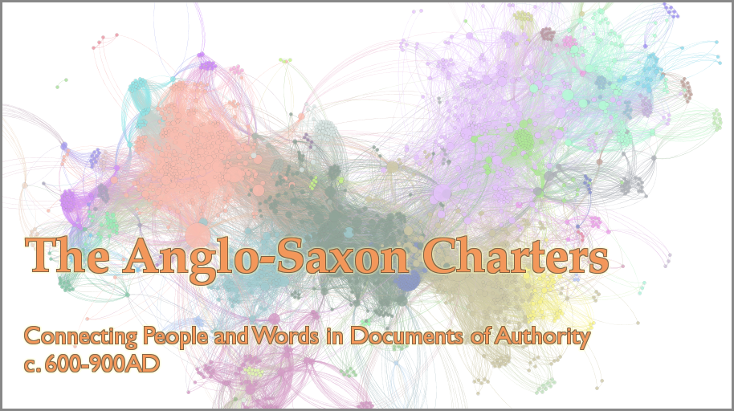
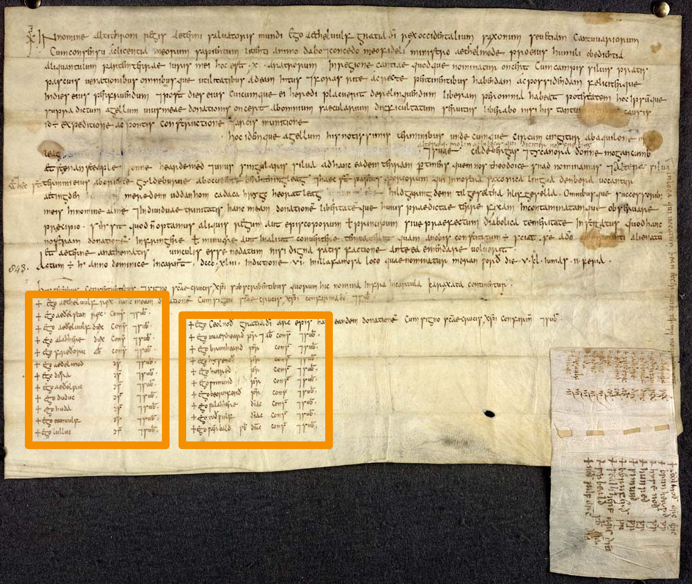

# The People of the Anglo-Saxon Charters Database

*DH Scraping and Analyzing Medieval Documents and People with Jupyter Notebook*



*A network of nearly 2,500 Anglo-Saxons from 600-900 A.D. connected by appearing together as witnesses in nearly 500 medieval documents.*

[David J. Thomas](mailto:dave.a.base@gmail.com), [thePort.us](http://thePort.us)

---

**Run this demonstration in-browser with Binder**

<a alt="Binder" href="https://mybinder.org/v2/gh/thePortus/asc-analysis/HEAD?urlpath=lab/notebooks/1-scrape.ipynb" target="_blank"><a/>

---

These exercises will show you how to get new insights out of existing historical sources. There are two databases connected with the [British Museum](https://www.britishmuseum.org/) containing information on over 600 medieval charters (grants of land or property). These workbooks will show you how I scraped the data from websites and connected over 2,500 individuals who appear in these documents in order to gain new insights. You can not only see the code I used, but execute it in your browser. If you don't want to download the repo, run it using the binder link below.

This repository will demonstrate how to...

* Fetch and scrape data using a parser
* Store in a local database using an ORM
* Export data for external use
* Analyze and visualize network relationships (largely complete, but lacking full documentation)
* Perform natural language processing (mostly incomplete, coming soon)

---

**Run this demonstration in-browser with Binder**

<a alt="Binder" href="https://mybinder.org/v2/gh/thePortus/asc-analysis/HEAD?urlpath=lab/notebooks/1-scrape.ipynb" target="_blank"><a/>

You don't even need to clone this repo manually. Click the Binder icon above and Binder will clone the repo and let you run it in browser. Run the scripts, generate the exportable data, and download the results to your local computer!

---

## Background

Together, the [Anglo-Saxon Charter (ASC)](http://aschart.kcl.ac.uk) and the [Prosopography of Anglo-Saxon England (PASE)](http://pase.ac.uk/) databases contain massive amounts of information on individuals and sources of individuals in England from 600-900 AD. These workbooks will show you how to use Python3 to scrape these two databases and explore and analyze the data in new ways using network and text analysis. This exercise will focus on charters, legal documents which framed power, and the people in them.

We will use the [requests](https://requests.kennethreitz.org/en/master/) and [BeautifulSoup](https://www.crummy.com/software/BeautifulSoup/bs4/doc/) modules to fetch and parse information, [SQLAlchemy](https://www.sqlalchemy.org/) to store it in a local database, [networkx](https://networkx.github.io) to perform network analysis, and finally the [nltk](http://nltk.org) and [cltk](https://cltk.readthedocs.io) modules to do some text analysis on the documents themselves.

---

Medieval charters were documents of importance and power. They bound institutions and powerful individuals together and created links that were displayed to wider communities. These charters were usually grants of land, often from a king, to a monastery, individual, or some other institution. These documents are not just passive windows into the past, scholars from [Geoffrey Koziol](https://history.berkeley.edu/geoffrey-koziol) to [Phillip Buc](https://ias.ceu.edu/people/philippe-buc) all recognize that the individuals who wrote them intended them to be persuasive and ideological documents. Even the use of minor honoriffic formulae (i.e. *gratia dei*, "By the grace of god") subtlely, but intentionally, linked the different rulers who used them. Historians generally are far more aware of the performative nature of aristocracy. No single title or claim made one an aristocrat so much as constellations of titles and connections with other elites. More importantly, all these claims and connections were constantly advertised and ritually performed (c.f. [Cheyette, Ermengard of Narbonne and the World of the Troubadours](https://www.amazon.com/Ermengard-Narbonne-Troubadours-Conjunctions-Religion/dp/0801489253); [Althoff, Family, Friends and Followers: Political and Social Bonds in Early Medieval Europe](https://www.amazon.com/Family-Friends-Followers-Political-Cambridge/dp/0521779340)). So, traditional historical research suggests these documents were important, and their relationships warrant investigation.

These charters were critical documents in the distribution of land and goods, and all contained witnesses whose authority guaranteed the legitimacy of these documents. These witness lists hold the key to exploring *en masse* what traditional historians have only examined *up close*. You can clearly see the lists of witnesses outlined in the image below.

---



*Charter of King Æthelwulf of Wessex to his minister Æthelmod, 843 A.D.* ([Source](https://tenthmedieval.wordpress.com/2014/08/21/before-you-write-a-charter/))

Spread over hundreds of documents, the totality of their interconnections reveals much about the Anglo-Saxon elite. We mush be careful, however. These documents were heavily ideological, and appearances together in a legal document do not necessarily denote a meaningful connection in practice. But, if we consider these documents another way, we can learn so much more. Looking at the sum of these connections may not tell us about the *reality* of social connections, but it can tell us worlds about the *image* of social relationships **that they wanted to project to others**.

Through the witness lists and the text of the charters themselves, these databases provide an excellent test ground for this approach. They are limited in space and time, allowing us to see change and evolution over time while maintaining a united historical and social context. The datasets are robust, without getting too large to analyze without more powerful tools. Above all, this is a demonstrate of methods and possibilities for other historical investigations.

While appearing together hardly means that there is any real connection between two witnesses, it does mean that they were openly connected and that their social authority was indirectly bound toegether. One goal of these workbooks is to unravel the connections and individuals bound up in these charters. Another goal is also to show you what can be done with an existing data source if you explore it in a new way.

* To technically minded people, I hope to show you how to apply these methods to historical topics.
* To historians, I hope to show you how current historiographical debates directly relate to, and can benefit from, not only the technical possibilities but also the theoretical discussions in various computational methodologies.

---

## Installation

```sh
# clone the repo and move inside the directory
git clone https://github.com/thePortus/asc-analysis && cd asc-analysis

# install python requirements
pip install -r requirements.txt

# launch notebook
jupyter notebook
```

If a new tab did not already open in your browers, navigate to
http://localhost:8000

Finally, open `notebooks/1-scrape.ipynb` to get started. Run every Python cell in order... note that some operations will take awhile to complete.

Any data generated during the process of running workbooks will be stored in the `/data` directory
